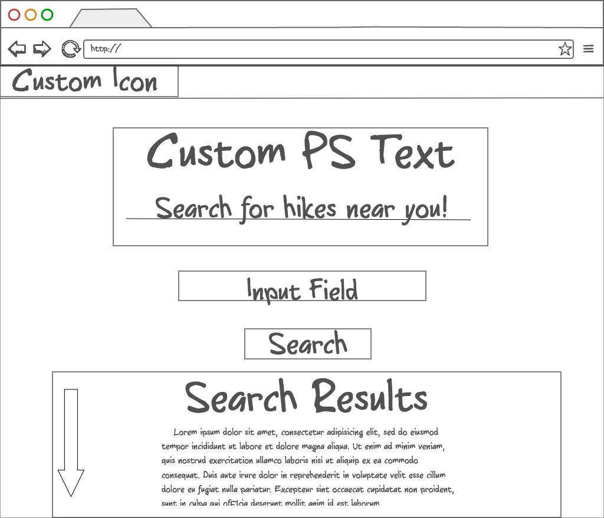

#Trail Blazer

**Technologies Used**

* HTML5/CSS3
* Angular
* D3 Liquid Fill Gauge
* Angular-Video-Background: html5 full screen video background in angular
* Express
* Node
* Mongo
* Mongoose
* Aashape
* TrailApi
* Photoshop

**General Approach**

* Brainstormed and wire framed my application. I used ninja mock for my wireframes.
* Built and styled the landing page, also set up routes between the pages.
* Started building my backend using express and node. 
* Consumed the TrailAPI 
* Built out my databases using mongo
* Styled pages and implemented Photoshop

**User stories**

* As a user I want to be able to easily search for hikes in my area.
* As a user I want to be able to gather the name, location, and description of the hikes in my area.
* As a user I want a pleasant UX/UI experience where the site is easily navigable and visually interesting.
* As a user I want easy 
* As a user I want to be able to save hikes that I am interested in and delete them from my profile when I am done with them.

**Unsolved problems**

* Adding notifications for when the user is successfully logged in/signed up
* Adding the delete feature to the profile page
* Adding an Angular Google maps directive so the user is not redirected to another webpage
* Adding transition slides using jQuery to create a seamless experience for the user 
* Perfecting the custom modal to close so the user can search again
* Have responsive design across all pages
* Add a CSS animation for the loading screen of the search page, when the api is retrieving the data
* Style the signup and profile page 
* Add more profile features like the option to upload a picture or connect with friends 

**Major Hurdles**

* Constructing the backend and database structures
* Building a responsive design without using a framework like bootstrap.

